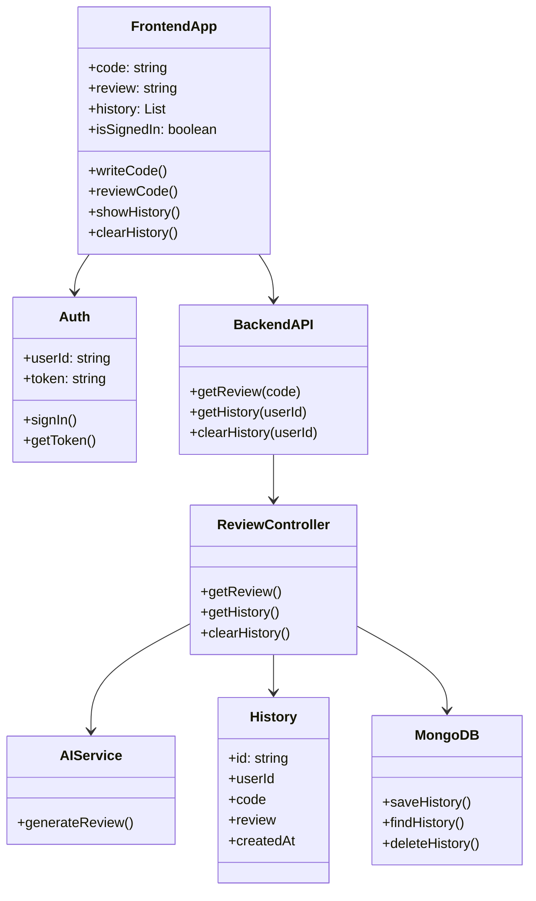
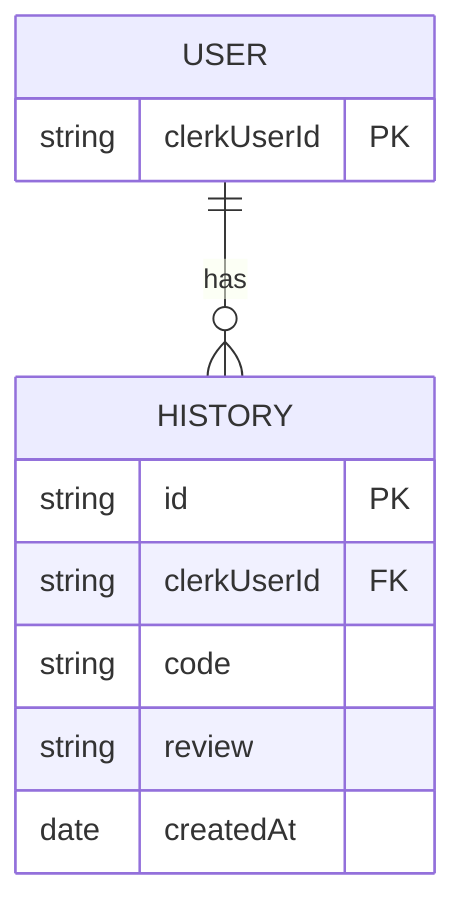
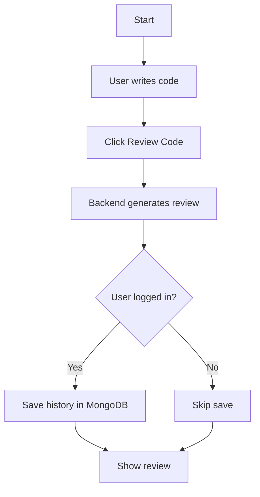
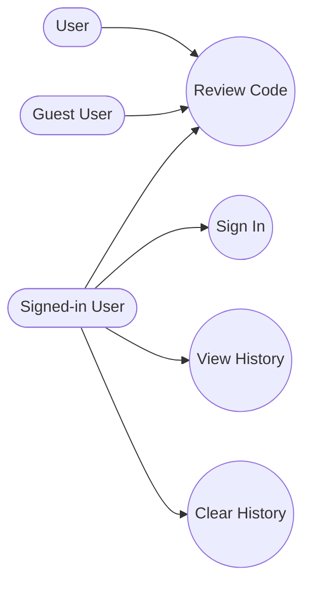
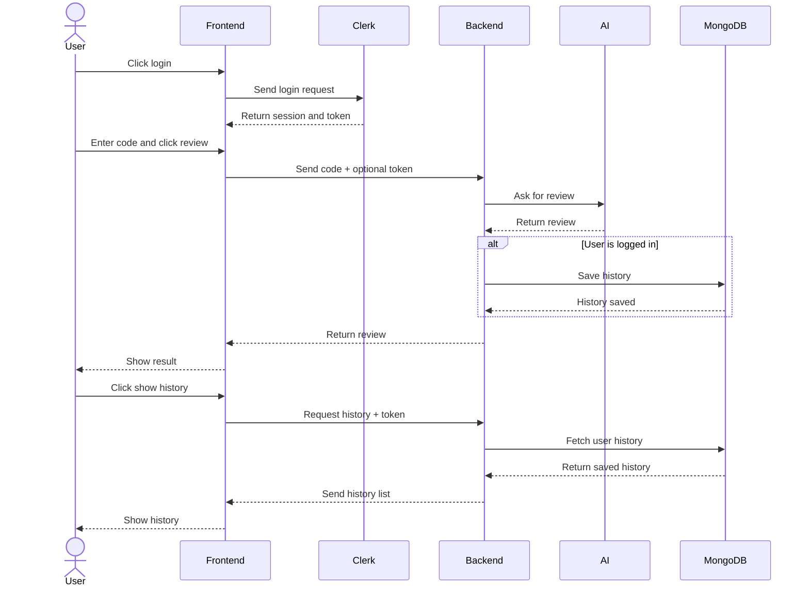
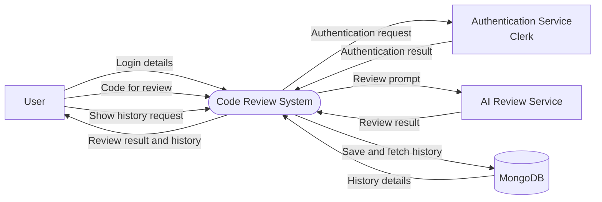
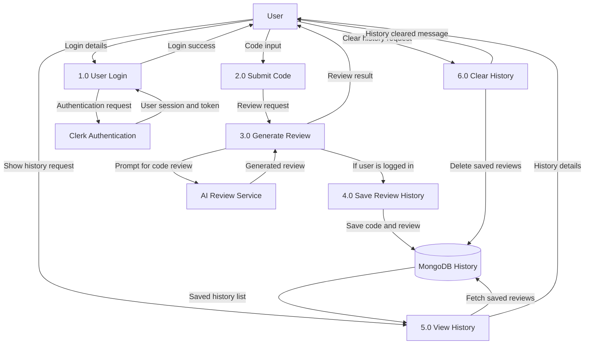

# Code Review System Diagrams

This file contains simple Mermaid diagrams for the main parts of the app:

- Frontend
- Clerk login
- Backend API
- MongoDB history
- AI review service

## 1. Class Diagram

## 2. ER Diagram

## 3. Activity Diagram

## 4. Use Case Diagram

## 5. Sequence Diagram

## 6. Context Level Diagram

## 7. Level 1 Diagram

## Short Notes

- Guest users can review code.
- Signed-in users can review code and save history.
- Clerk handles login.
- MongoDB stores history.
- Backend connects frontend, AI, and database.
